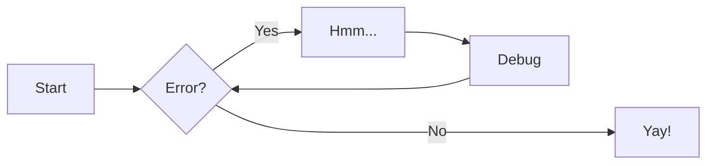

## Project Setup Guide
The setup below is inline with the Python Project Template (in progress) on the UKSI GitHub.

If you are already set up locally, we recommend **uv** as a project management tool. It is very easy to use and install! 
Install on Windows:
1. Search "powershell" in your windows search bar
2. Copy this into your powershell terminal: powershell -ExecutionPolicy ByPass -c "irm https://astral.sh/uv/install.ps1 | iex"
3. Close powershell. That's it installed! 
More [info on installation](https://docs.astral.sh/uv/getting-started/installation/) here.

For new projects: 
1. Setup a Github repository. Use a [template](https://github.com/English-Institute-of-Sport/Python_Project_Template) if starting a new project, otherwise, create an empty repository and follow the instructions to setup an existing project (and proceed to step 4).
2. Setup your project environment using uv.
    - ensure or navigate to the relevant root (filepath)
    - use `uv init` in the terminal to create the relevant files for you, including a virtual environment. 
    - Run scripts or tests with `uv run ...`
    - Add dependencies (libraries, modules) with `uv add ...`
    - For more info go to: https://docs.astral.sh/uv/guides/projects/
3. Clone the repository into the root of your project environment (you should see a `.git` folder in the root of your project folder). This is easiest to do in GitHub Desktop or directly in a new VS Code window. 
    - We recommend having all code stored in a "dev" folder directly on your c drive as it minimises the filepath and avoids potential issues with OneDrive storage. 
4. Your project (new or existing) should at the least contain the following files:
    - `Readme.md` file (with contributing guideline).
    - `.gitignore` file.
    - `pyproject.toml` file.
    - `uv.lock` file.
5. Before you jump straight into the coding, remember to follow all the advice in this document! 

>## uv troubleshooting
>If command not found after install, restart terminal.
>If sync fails, delete .venv and run uv sync again.
>Confirm Python version via project config before syncing.

## Link Test

[Link to TestTest](./TestTest.md)

## Admonition Test

!!! info

    Admonition Test 1

    
!!! Warning

    Admonition Test 2

    
!!! Danger

    Admonition Test 3

## Code Block Test

``` py title="bubble_sort.py"
def bubble_sort(items):
    for i in range(len(items)):
        for j in range(len(items) - 1 - i):
            if items[j] > items[j + 1]:
                items[j], items[j + 1] = items[j + 1], items[j]
```

## Grids Test

<div class="grid cards" markdown>

-   :material-clock-fast:{ .lg .middle } __Set up in 5 minutes__

    ---

    Install [`mkdocs-material`](#) with [`pip`](#) and get up
    and running in minutes

    [:octicons-arrow-right-24: Getting started](#)

-   :fontawesome-brands-markdown:{ .lg .middle } __It's just Markdown__

    ---

    Focus on your content and generate a responsive and searchable static site

    [:octicons-arrow-right-24: Reference](#)

-   :material-format-font:{ .lg .middle } __Made to measure__

    ---

    Change the colors, fonts, language, icons, logo and more with a few lines

    [:octicons-arrow-right-24: Customization](#)

-   :material-scale-balance:{ .lg .middle } __Open Source, MIT__

    ---

    Material for MkDocs is licensed under MIT and available on [GitHub]

    [:octicons-arrow-right-24: License](#)

</div>

## Data Table Test

| Method      | Description                          |
| ----------- | ------------------------------------ |
| `GET`       | :material-check:     Fetch resource  |
| `PUT`       | :material-check-all: Update resource |
| `DELETE`    | :material-close:     Delete resource |

## Mermaid Test



## Image Test

<figure markdown="span">
  { width="300" }
  <figcaption>Image caption</figcaption>
</figure>
